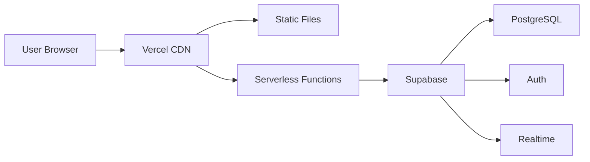

## Overview

This guide will walk you through deploying your own Hive instance. Hive is designed to be easy to deploy on modern serverless platforms, with Vercel as the recommended option.

<Note>
  This guide assumes you have basic familiarity with Git, npm, and environment variables. If you're new to these tools, check out the linked resources.
</Note>

## Prerequisites

Before you begin, make sure you have:

- **Node.js 18+** installed on your machine
- **Git** for version control
- A **Supabase account** (free tier works great)
- A **Vercel account** (free tier recommended for hosting)
- A **GitHub account** for code repository

## Architecture Overview



<Steps>

### Step 1: Clone the Repository

First, clone the Hive repository from GitHub:

<CodeGroup>

```bash SSH
git clone git@github.com:Knill01/PM-Hive.git hive
cd hive
```

```bash HTTPS
git clone https://github.com/Knill01/PM-Hive.git hive
cd hive
```

</CodeGroup>

Install dependencies:

<CodeGroup>

```bash npm
cd frontend
npm install
```

```bash yarn
cd frontend
yarn install
```

```bash pnpm
cd frontend
pnpm install
```

</CodeGroup>

<Info>
  Hive uses minimal dependencies—only `@supabase/supabase-js` for the backend connection.
</Info>

### Step 2: Set Up Supabase

Supabase provides the backend infrastructure (database, auth, and realtime).

**2.1 Create a Supabase Project:**

1. Go to [supabase.com](https://supabase.com) and sign in
2. Click **"New Project"**
3. Choose a name, database password, and region
4. Wait for the project to be provisioned (~2 minutes)

**2.2 Configure Database Schema:**

Hive requires several database tables. Run these SQL commands in the Supabase SQL Editor:

```sql schema.sql
-- Users table (extends Supabase Auth)
CREATE TABLE usuarios (
  id SERIAL PRIMARY KEY,
  auth_user_id UUID REFERENCES auth.users(id) ON DELETE CASCADE,
  nombre_usuario TEXT UNIQUE NOT NULL,
  correo TEXT UNIQUE NOT NULL,
  nombre_completo TEXT,
  puesto TEXT,
  cedula TEXT UNIQUE,
  foto_url TEXT,
  ultimo_acceso TIMESTAMPTZ,
  presence_state TEXT DEFAULT 'offline',
  fecha_registro TIMESTAMPTZ DEFAULT NOW()
);

-- Projects table
CREATE TABLE proyectos (
  id SERIAL PRIMARY KEY,
  nombre TEXT UNIQUE NOT NULL,
  descripcion TEXT,
  estado TEXT DEFAULT 'activo',
  fecha_inicio DATE NOT NULL,
  fecha_fin DATE NOT NULL,
  color TEXT DEFAULT '#ECFDF5',
  opa FLOAT DEFAULT 0.65,
  creador_id INTEGER REFERENCES usuarios(id) ON DELETE SET NULL,
  fecha_creacion TIMESTAMPTZ DEFAULT NOW()
);

-- Tasks table
CREATE TABLE tareas (
  id SERIAL PRIMARY KEY,
  titulo TEXT NOT NULL,
  descripcion TEXT,
  estado TEXT DEFAULT 'pendiente',
  prioridad TEXT DEFAULT 'media',
  fecha_vencimiento DATE,
  fecha_creacion TIMESTAMPTZ DEFAULT NOW(),
  porcentaje_completado INTEGER DEFAULT 0,
  proyecto_id INTEGER REFERENCES proyectos(id) ON DELETE CASCADE,
  CHECK (porcentaje_completado >= 0 AND porcentaje_completado <= 100)
);

-- Tags table
CREATE TABLE etiquetas (
  id SERIAL PRIMARY KEY,
  nombre TEXT UNIQUE NOT NULL,
  color TEXT DEFAULT '#3B82F6'
);

-- Task-Tag junction table
CREATE TABLE tarea_etiquetas (
  tarea_id INTEGER REFERENCES tareas(id) ON DELETE CASCADE,
  etiqueta_id INTEGER REFERENCES etiquetas(id) ON DELETE CASCADE,
  PRIMARY KEY (tarea_id, etiqueta_id)
);

-- Task-User junction table (assignments)
CREATE TABLE tarea_usuarios (
  tarea_id INTEGER REFERENCES tareas(id) ON DELETE CASCADE,
  usuario_id INTEGER REFERENCES usuarios(id) ON DELETE CASCADE,
  PRIMARY KEY (tarea_id, usuario_id)
);

-- Deleted users (ban list)
CREATE TABLE usuarios_borrados (
  id SERIAL PRIMARY KEY,
  nombre_usuario TEXT,
  correo TEXT,
  fecha_eliminacion TIMESTAMPTZ DEFAULT NOW()
);

-- Enable Row Level Security
ALTER TABLE usuarios ENABLE ROW LEVEL SECURITY;
ALTER TABLE proyectos ENABLE ROW LEVEL SECURITY;
ALTER TABLE tareas ENABLE ROW LEVEL SECURITY;
ALTER TABLE etiquetas ENABLE ROW LEVEL SECURITY;
ALTER TABLE tarea_etiquetas ENABLE ROW LEVEL SECURITY;
ALTER TABLE tarea_usuarios ENABLE ROW LEVEL SECURITY;

-- RLS Policies (allow authenticated users to read/write)
CREATE POLICY "Allow authenticated users" ON usuarios
  FOR ALL USING (auth.role() = 'authenticated');

CREATE POLICY "Allow authenticated users" ON proyectos
  FOR ALL USING (auth.role() = 'authenticated');

CREATE POLICY "Allow authenticated users" ON tareas
  FOR ALL USING (auth.role() = 'authenticated');

CREATE POLICY "Allow authenticated users" ON etiquetas
  FOR ALL USING (auth.role() = 'authenticated');

CREATE POLICY "Allow authenticated users" ON tarea_etiquetas
  FOR ALL USING (auth.role() = 'authenticated');

CREATE POLICY "Allow authenticated users" ON tarea_usuarios
  FOR ALL USING (auth.role() = 'authenticated');
```

<Warning>
  Make sure to enable Row Level Security (RLS) to protect your data. The policies above allow any authenticated user to access all data—adjust based on your security requirements.
</Warning>

**2.3 Enable Realtime:**

1. Go to **Database → Replication** in Supabase dashboard
2. Enable replication for these tables:
   - `tareas`
   - `tarea_etiquetas`
   - `tarea_usuarios`
   - `proyectos`

<Tip>
  Realtime replication allows Hive to receive instant updates when data changes in the database.
</Tip>

**2.4 Get Your API Credentials:**

1. Go to **Settings → API** in Supabase dashboard
2. Copy these values:
   - **Project URL** (e.g., `https://xxxxx.supabase.co`)
   - **anon/public key** (starts with `eyJ...`)
   - **service_role key** (starts with `eyJ...`) - ⚠️ Keep this secret!

### Step 3: Configure Environment Variables

Create environment variable configuration for your deployment:

**For Vercel Deployment:**

1. Go to your project in Vercel dashboard
2. Navigate to **Settings → Environment Variables**
3. Add these variables:

| Variable | Value | Description |
|----------|-------|-------------|
| `NEXT_PUBLIC_SUPABASE_URL` | `https://xxxxx.supabase.co` | Your Supabase project URL |
| `NEXT_PUBLIC_SUPABASE_ANON_KEY` | `eyJ...` | Your Supabase anon/public key |
| `SUPABASE_SERVICE_KEY` | `eyJ...` | Your Supabase service_role key (⚠️ secret) |

<Warning>
  Never commit the `service_role` key to your Git repository. This key has full database access and should only be used server-side.
</Warning>

**For Local Development:**

The Hive client reads credentials from global variables. You can set them in the browser console or create a `.env` file:

```javascript frontend/js/supabaseClient.js
// Credentials are read from multiple sources
const supabaseUrl =
  process.env?.NEXT_PUBLIC_SUPABASE_URL ||
  window.SUPABASE_URL ||
  'https://vcssfbdprqmpmuhwaapb.supabase.co'; // fallback for dev

const supabaseAnonKey =
  process.env?.NEXT_PUBLIC_SUPABASE_ANON_KEY ||
  window.SUPABASE_ANON_KEY ||
  'eyJ...'; // fallback for dev

const supabaseServiceKey =
  process.env?.SUPABASE_SERVICE_KEY ||
  window.SUPABASE_SERVICE_KEY ||
  'eyJ...'; // fallback for dev

// Initialize clients
const supabase = window.supabase.createClient(
  supabaseUrl,
  supabaseAnonKey
);

const supabaseAdmin = window.supabase.createClient(
  supabaseUrl,
  supabaseServiceKey
);

window.__supabaseClient = supabase;
window.__supabaseAdmin = supabaseAdmin;
```

<Info>
  For production, always use environment variables. The fallback values in the code are only for local development.
</Info>

### Step 4: Deploy to Vercel

Vercel provides free hosting for static sites with serverless functions.

**4.1 Install Vercel CLI:**

<CodeGroup>

```bash npm
npm install -g vercel
```

```bash yarn
yarn global add vercel
```

```bash pnpm
pnpm add -g vercel
```

</CodeGroup>

**4.2 Deploy:**

```bash
cd frontend
vercel
```

Follow the prompts:

1. **Link to existing project?** → No (first time)
2. **Project name?** → `hive` (or your choice)
3. **Directory containing code?** → `./` (current directory)
4. **Override settings?** → No

<Tip>
  The Vercel CLI will automatically detect your project type and configure build settings.
</Tip>

**4.3 Add Environment Variables:**

After deployment, add your Supabase credentials in the Vercel dashboard (as described in Step 3).

**4.4 Redeploy with Environment Variables:**

```bash
vercel --prod
```

Your Hive instance is now live! 🎉

### Step 5: Create Your First Admin User

To access your new Hive instance, create an admin user in Supabase:

**5.1 Create Auth User:**

1. Go to **Authentication → Users** in Supabase dashboard
2. Click **"Add user"**
3. Enter email and password
4. Click **"Create user"**

**5.2 Add User Record:**

Run this SQL in Supabase SQL Editor (replace with your values):

```sql
INSERT INTO usuarios (
  auth_user_id,
  nombre_usuario,
  correo,
  nombre_completo,
  puesto
) VALUES (
  'YOUR_AUTH_USER_ID', -- Get this from Authentication → Users
  'admin',
  'admin@yourcompany.com',
  'Admin User',
  'Administrator'
);
```

<Warning>
  Make sure the `auth_user_id` matches the UUID from the Supabase Auth user you just created.
</Warning>

Now you can log in with your email and password!

### Step 6: Configure Additional Settings (Optional)

**Custom Domain:**

1. Go to **Settings → Domains** in Vercel
2. Add your domain (e.g., `hive.yourcompany.com`)
3. Update DNS records as instructed

**Email Notifications:**

1. Go to **Authentication → Email Templates** in Supabase
2. Customize confirmation and reset password emails
3. Configure SMTP settings for custom email domain

**Storage for Avatars:**

1. Go to **Storage** in Supabase dashboard
2. Create a bucket named `avatars`
3. Set permissions to allow authenticated uploads

</Steps>

## Alternative Deployment Options

### Self-Hosted (Docker)

Hive can be self-hosted using Docker:

```dockerfile Dockerfile
FROM node:18-alpine

WORKDIR /app

COPY frontend/package*.json ./
RUN npm ci --only=production

COPY frontend/ ./

EXPOSE 3000

CMD ["npx", "http-server", "-p", "3000"]
```

```yaml docker-compose.yml
version: '3.8'

services:
  hive:
    build: .
    ports:
      - "3000:3000"
    environment:
      - NEXT_PUBLIC_SUPABASE_URL=${SUPABASE_URL}
      - NEXT_PUBLIC_SUPABASE_ANON_KEY=${SUPABASE_ANON_KEY}
      - SUPABASE_SERVICE_KEY=${SUPABASE_SERVICE_KEY}
```

Run with:

```bash
docker-compose up -d
```

### Static Hosting (Netlify, Cloudflare Pages)

Hive's frontend is entirely static and can be hosted anywhere:

1. Build the frontend: `npm run build` (if you have a build script)
2. Upload the `frontend/` directory to your static host
3. Configure environment variables in the hosting platform

## Troubleshooting

### Supabase Connection Issues

**Problem**: "Supabase CDN no cargado" error in console

**Solution**: Make sure the Supabase CDN script is loaded in `index.html`:

```html
<script src="https://unpkg.com/@supabase/supabase-js"></script>
```

### Authentication Fails

**Problem**: "Usuario o contraseña incorrectos" even with correct credentials

**Solution**: Check these:

1. Verify the `usuarios` record has the correct `auth_user_id`
2. Make sure the user is not in `usuarios_borrados` (ban list)
3. Check RLS policies allow the user to read from `usuarios` table

### Realtime Not Working

**Problem**: Changes don't appear in real-time

**Solution**:

1. Verify replication is enabled in Supabase (Database → Replication)
2. Check browser console for WebSocket errors
3. Ensure `PMH_ENABLE_REALTIME` is `true` in app.js:

```javascript
window.PMH_ENABLE_REALTIME = true;
```

### Tasks Not Saving

**Problem**: Tasks appear briefly then disappear

**Solution**: Check RLS policies on `tareas` table. You may need to adjust:

```sql
CREATE POLICY "Allow task creation" ON tareas
  FOR INSERT WITH CHECK (auth.role() = 'authenticated');

CREATE POLICY "Allow task updates" ON tareas
  FOR UPDATE USING (auth.role() = 'authenticated');
```

## Performance Optimization

### Enable Caching

Configure Vercel edge caching for static assets:

```json vercel.json
{
  "headers": [
    {
      "source": "/css/(.*)",
      "headers": [
        {
          "key": "Cache-Control",
          "value": "public, max-age=31536000, immutable"
        }
      ]
    },
    {
      "source": "/js/(.*)",
      "headers": [
        {
          "key": "Cache-Control",
          "value": "public, max-age=31536000, immutable"
        }
      ]
    }
  ]
}
```

### Database Indexes

Add indexes for common queries:

```sql
CREATE INDEX idx_tareas_proyecto_id ON tareas(proyecto_id);
CREATE INDEX idx_tareas_estado ON tareas(estado);
CREATE INDEX idx_tarea_usuarios_usuario_id ON tarea_usuarios(usuario_id);
CREATE INDEX idx_usuarios_auth_user_id ON usuarios(auth_user_id);
```

## Security Best Practices

<Warning>
  Always follow these security guidelines in production:
</Warning>

1. **Never expose `service_role` key** - Only use it server-side in Vercel functions
2. **Use RLS policies** - Restrict data access based on user roles
3. **Validate input** - Sanitize all user input on the client and server
4. **Enable HTTPS** - Vercel provides this automatically
5. **Regular backups** - Supabase has automatic backups, but test recovery

## Next Steps

Your Hive instance is now running! Here's what to do next:

<CardGroup cols={2}>
  <Card title="Quickstart Guide" icon="rocket" href="/quickstart">
    Log in and create your first project
  </Card>
  
  <Card title="Authentication Setup" icon="lock" href="/guides/authentication">
    Configure user roles and permissions
  </Card>
  
  <Card title="Environment Config" icon="gear" href="/configuration/environment">
    Learn about all available environment variables
  </Card>
  
  <Card title="Supabase Configuration" icon="database" href="/configuration/supabase">
    Advanced Supabase setup and optimization
  </Card>
</CardGroup>

## Getting Help

If you run into issues:

- Check the [GitHub Issues](https://github.com/Knill01/PM-Hive/issues) for known problems
- Review the Supabase [documentation](https://supabase.com/docs)
- Check Vercel's [deployment guides](https://vercel.com/docs)
- Contact your Hive administrator
