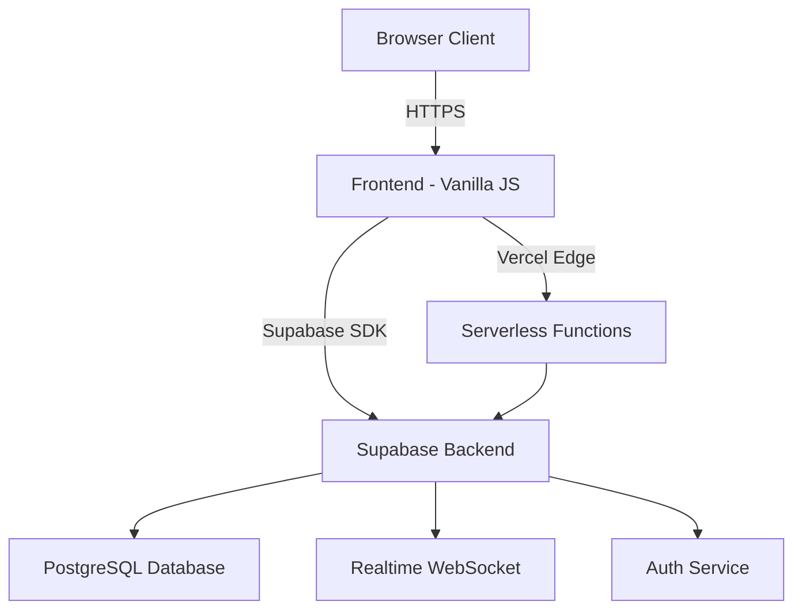

## What is Hive?

Hive is a **modern project management platform** designed to help teams organize projects, track tasks, and collaborate effectively. Built with a JavaScript frontend and powered by Supabase for real-time synchronization, Hive brings your team's work together in one intuitive interface.

<Info>
  Hive leverages real-time updates so changes made by one team member are instantly visible to everyone else—no refresh required.
</Info>

## Who is Hive For?

Hive is ideal for:

- **Small to medium-sized teams** looking for lightweight project management
- **Development teams** that need real-time task tracking and collaboration
- **Organizations** wanting to self-host their project management tools
- **Teams** that value simplicity and speed over complex enterprise features

## Key Capabilities

Hive provides everything you need to manage team projects efficiently:

<CardGroup cols={2}>
  <Card title="Project Management" icon="folder-tree">
    Create and organize projects with custom colors, dates, and milestones. Track progress across multiple projects simultaneously.
  </Card>
  
  <Card title="Task Tracking" icon="list-check">
    Create tasks with titles, descriptions, due dates, priorities, and assignees. Drag and drop tasks between projects and statuses.
  </Card>
  
  <Card title="Real-time Collaboration" icon="arrows-rotate">
    All changes sync instantly across all connected clients. See who's working on what in real-time with presence indicators.
  </Card>
  
  <Card title="Team Management" icon="users">
    Manage team members with profiles, contact information, and presence status. Track workload and task assignments.
  </Card>
  
  <Card title="Dashboard Analytics" icon="chart-line">
    Visualize project progress with charts and metrics. Monitor task completion rates and team workload distribution.
  </Card>
  
  <Card title="Calendar View" icon="calendar">
    View all tasks and deadlines in a calendar interface. Plan ahead and avoid scheduling conflicts.
  </Card>
</CardGroup>

## System Architecture

Hive follows a modern, serverless architecture:



### Frontend Layer

The frontend is built with **vanilla JavaScript** and TailwindCSS:

- **`app.js`** - Core application logic, UI rendering, and state management
- **`supabaseClient.js`** - Database client initialization and configuration
- **`authSession.js`** - Authentication session management
- **`app.realtime.js`** - Real-time event handlers and synchronization

<CodeGroup>

```javascript app.js (Initialization)
// Global state management
let currentUser = JSON.parse(localStorage.getItem('user')) || null;
let tasks = [];
let employees = [];
let projects = [];
let tags = [];

// Supabase singleton
let supabase = null;
if (window.__supabaseClient) {
  supabase = window.__supabaseClient;
} else if (window.supabase && window.supabase.createClient) {
  supabase = window.supabase.createClient(
    window.SUPABASE_URL,
    window.SUPABASE_ANON_KEY
  );
  window.__supabaseClient = supabase;
}
```

```javascript supabaseClient.js (Client Setup)
const supabaseUrl = 
  process.env?.NEXT_PUBLIC_SUPABASE_URL ||
  window.SUPABASE_URL;

const supabaseAnonKey = 
  process.env?.NEXT_PUBLIC_SUPABASE_ANON_KEY ||
  window.SUPABASE_ANON_KEY;

const supabase = window.supabase.createClient(
  supabaseUrl, 
  supabaseAnonKey
);

window.__supabaseClient = supabase;
```

</CodeGroup>

### Backend Layer

The backend uses **Supabase** (open-source Firebase alternative):

- **PostgreSQL Database** - Core data storage (users, projects, tasks, tags)
- **Supabase Auth** - JWT-based authentication and authorization
- **Realtime** - WebSocket subscriptions for live updates
- **Row Level Security** - Database-level access control

<Tip>
  Supabase provides a powerful REST API and realtime subscriptions out of the box, eliminating the need to write custom backend code.
</Tip>

### Realtime Synchronization

Hive uses Supabase Realtime to synchronize changes across all connected clients:

```javascript app.realtime.js (Channel Setup)
function wireRealtimeForTasks() {
  const client = window.__supabaseClient;
  
  // Global task changes channel
  const ch = client.channel('rt-pmh-tareas-global');
  
  ch.on('postgres_changes', { 
    event: '*', 
    schema: 'public', 
    table: 'tareas' 
  }, async (payload) => {
    const eventType = payload?.eventType;
    const taskId = payload?.new?.id || payload?.old?.id;
    
    if (eventType === 'INSERT') {
      await addTaskToUI(payload.new);
    } else if (eventType === 'UPDATE') {
      await updateTaskInUI(payload.new);
    } else if (eventType === 'DELETE') {
      await removeTaskFromUI(taskId);
    }
  });
  
  ch.subscribe();
}
```

## Core Use Cases

### 1. Project Planning

Create projects with start/end dates, assign team members, and break work into tasks. Track progress with visual indicators and analytics.

### 2. Task Management

Organize tasks by project, priority, and status. Assign multiple team members to tasks and track completion percentages.

### 3. Team Coordination

See who's online, what they're working on, and collaborate in real-time without constant meetings or status updates.

### 4. Progress Tracking

Monitor project health with dashboards showing task completion rates, workload distribution, and upcoming deadlines.

## Technology Stack

<CardGroup cols={2}>
  <Card title="Frontend" icon="browser">
    - Vanilla JavaScript (ES6+)
    - TailwindCSS
    - Chart.js for visualizations
    - jQuery for DOM manipulation
  </Card>
  
  <Card title="Backend" icon="database">
    - Supabase (PostgreSQL + Auth + Realtime)
    - Row Level Security (RLS)
    - Vercel Serverless Functions
  </Card>
  
  <Card title="Deployment" icon="cloud">
    - Vercel (recommended)
    - Static file hosting
    - Edge functions for API routes
  </Card>
  
  <Card title="Development" icon="code">
    - Git version control
    - NPM package management
    - Modern browser targets
  </Card>
</CardGroup>

## Next Steps

Ready to get started with Hive?

<CardGroup cols={2}>
  <Card title="Quickstart Guide" icon="rocket" href="/quickstart">
    Follow our step-by-step guide to create your first project and task
  </Card>
  
  <Card title="Installation Guide" icon="download" href="/installation">
    Deploy Hive on your own infrastructure with Supabase and Vercel
  </Card>
  
  <Card title="Explore Features" icon="compass" href="/features/projects">
    Learn about all the features Hive has to offer
  </Card>
  
  <Card title="API Reference" icon="book" href="/api/overview">
    Integrate Hive with your existing tools and workflows
  </Card>
</CardGroup>
